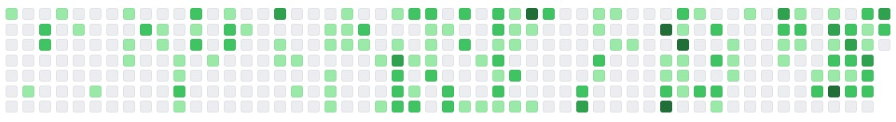

# Angular Github Contribuions

An angular component to reproduce the appearence and behaviour of the Github contributions board. So far, the component supports custom color themes and time span, but more options will be added in the future.

- [Angular Github Contribuions](#angular-github-contribuions)
  - [Overview](#overview)
  - [Usage](#usage)
    - [Options](#options)
      - [GithubColorPalette Type](#githubcolorpalette-type)
      - [GithubBoardLabelOptions Type](#githubboardlabeloptions-type)

## Overview

Default appearence


Custom colors


Custom time span


Hiding labels


## Usage

Basic usage

```html
<app-github-board
    [profile]="'luizppa'"
    [token]="token"
    [onCellClick]="onCellClickHandler"
    [options]="boardOptions">
</app-github-board>
```

### Options

Optionally, you can specify an options object to configure the appearence fo the board. The available options are shown on the table bellow:

| Option       | Type                    | Description                                                                     |
|--------------|-------------------------|---------------------------------------------------------------------------------|
| cellSize     | number                  | Defines the size of each individual board cell in pixels.                       |
| weeksNumber  | number                  | Defines the time span shwon on the board in number of weeks.                    |
| colorPalette | GithubBoardColorPalette | Defines the color palette for the board cells.                                  |
| labels       | GithubBoardLabelOptions | Defines the properties of the labels indicating day and month around the board. |

#### GithubColorPalette Type

Object that defines the color scheme to use on the board. The colors must be specified as strings in any HTML suported format (HEX, rgb, rgba...).

| Option | Type   | Description                                                  |
|--------|--------|--------------------------------------------------------------|
| none   | string | Defines the color for cells with no contributions.           |
| low    | string | Defines the color for cells with 1 - 3 contributions.        |
| medium | string | Defines the color for cells with 4 - 8 contributions.        |
| high   | string | Defines the color for cells with 9 - 10 contributions.       |
| higher | string | Defines the color for cells with more than 10 contributions. |

#### GithubBoardLabelOptions Type

| Option    | Type    | Description                                   |
|-----------|---------|-----------------------------------------------|
| showMonth | boolean | Defines whether or not to show month labels.  |
| showDay   | boolean | Defines whether or not to show day labels.    |
| size      | number  | Defines the font size of the labels in pixels.|
