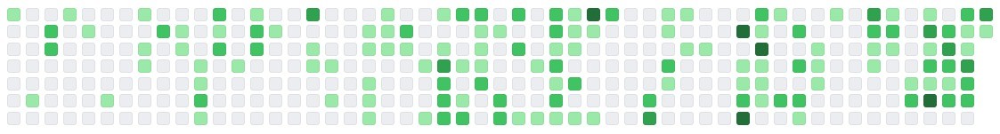
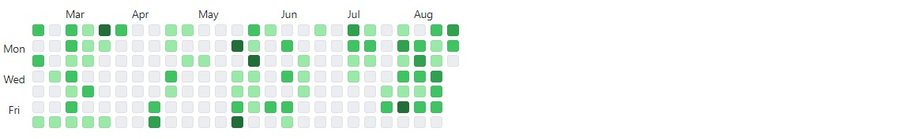

# Angular Github Contribuions

An angular component to reproduce the appearence and behaviour of the Github contributions board. So far, the component supports custom color themes and time span, but more options will be added in the future.

- [Angular Github Contribuions](#angular-github-contribuions)
  - [Examples](#examples)
  - [Usage](#usage)

## Examples

Default appearence


Custom colors


Custom time span


## Usage

Code snippet

```html
<app-github-board
    [profile]="'luizppa'"
    [token]="token">
</app-github-board>
```